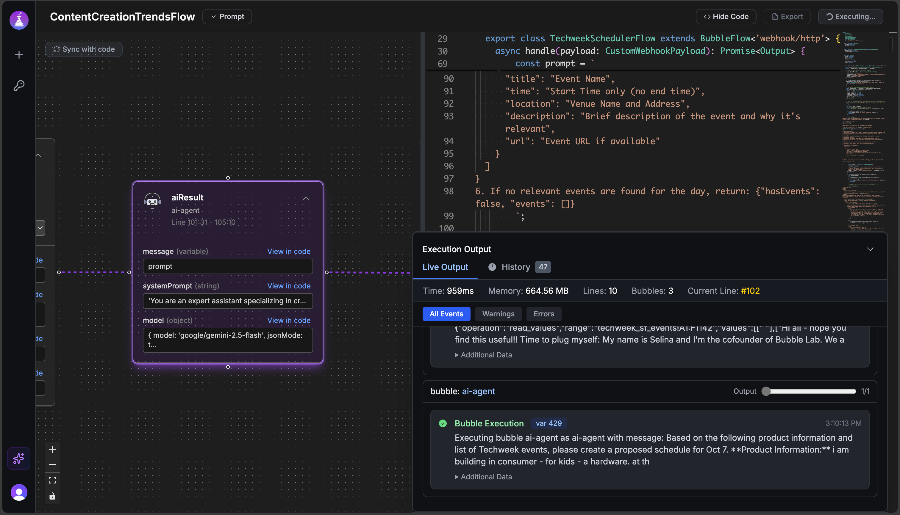

# Bubble Lab

[](https://discord.com/invite/PkJvcU2myV)
[](https://docs.bubblelab.ai/intro)
[](https://github.com/bubblelabai/BubbleLab/stargazers)
[](https://github.com/bubblelabai/BubbleLab/actions/workflows/ci.yml)
[](./LICENSE.txt)
[](https://www.typescriptlang.org/)
[](https://github.com/bubblelabai/BubbleLab/pulls)

Open-source agentic workflow automation builder with full observability and exportability.

- Orchestrate workflows in TypeScript with visual feedback side-by-side
- Built-in AI Assistant to instantly spin up a workflow and amend as needed
- Import existing N8N workflow
- Full observability
- Export workflows directly to your JS/TS backend



## 🚀 Quick Start

### 1. Hosted Bubble Studio (Fastest Way)

The quickest way to get started with BubbleLab is through our hosted Bubble Studio:

<!-- Insert screenshot here -->

**Benefits:**

- No setup required - start building immediately
- Visual flow builder with drag-and-drop interface
- Export your flows to run on your own backend
- Free AI credits

👉 [Try Bubble Studio Now](https://app.bubblelab.ai)

In addition, you can try Bubble Studio in **two command**, locally (not suited for production):

```bash
# 1. Install dependencies
pnpm install

# 2. Start everything
pnpm run dev
```

### 2. Create BubbleLab App

Get started with BubbleLab in seconds using our CLI tool:

```bash
npx create-bubblelab-app
```

This will scaffold a new BubbleLab project with:

- Pre-configured TypeScript setup with core packages and run time installed
- Sample templates (basic, reddit-scraper, etc.) you can choose
- All necessary dependencies
- Ready-to-run example workflows you fully control, customize

**Next steps after creation:**

```bash
cd my-agent
npm install
npm run dev
```

#### What You'll Get: Real-World Example

Let's look at what BubbleFlow code actually looks like using the **reddit-scraper** template:

**The Flow** (`reddit-news-flow.ts`) - Just **~50 lines** of clean TypeScript:

```typescript
export class RedditNewsFlow extends BubbleFlow<'webhook/http'> {
  async handle(payload: RedditNewsPayload) {
    const subreddit = payload.subreddit || 'worldnews';
    const limit = payload.limit || 10;

    // Step 1: Scrape Reddit for posts
    const scrapeResult = await new RedditScrapeTool({
      subreddit: subreddit,
      sort: 'hot',
      limit: limit,
    }).action();

    const posts = scrapeResult.data.posts;

    // Step 2: AI analyzes and summarizes the posts
    const summaryResult = await new AIAgentBubble({
      message: `Analyze these top ${posts.length} posts from r/${subreddit}:
        ${postsText}

        Provide: 1) Summary of top news, 2) Key themes, 3) Executive summary`,
      model: { model: 'google/gemini-2.5-flash' },
    }).action();

    return {
      subreddit,
      postsScraped: posts.length,
      summary: summaryResult.data?.response,
      status: 'success',
    };
  }
}
```

**What happens when you run it:**

```bash
$ npm run dev

✅ Reddit scraper executed successfully
{
  "subreddit": "worldnews",
  "postsScraped": 10,
  "summary": "### Top 5 News Items:\n1. China Halts US Soybean Imports...\n2. Zelensky Firm on Ukraine's EU Membership...\n3. Hamas Demands Release of Oct 7 Attackers...\n[full AI-generated summary]",
  "timestamp": "2025-10-07T21:35:19.882Z",
  "status": "success"
}

Execution Summary:
  Total Duration: 13.8s
  Bubbles Executed: 3 (RedditScrapeTool → AIAgentBubble → Return)
  Token Usage: 1,524 tokens (835 input, 689 output)
  Memory Peak: 139.8 MB
```

**What's happening under the hood:**

1. **RedditScrapeTool** scrapes 10 hot posts from r/worldnews
2. **AIAgentBubble** (using Google Gemini) analyzes the posts
3. Returns structured JSON with summary, themes, and metadata
4. Detailed execution stats show performance and token usage

**Key Features:**

- **Type-safe** - Full TypeScript support with proper interfaces
- **Simple** - Just chain "Bubbles" (tools/nodes) together with `.action()`
- **Observable** - Built-in logging shows exactly what's executing
- **Production-ready** - Error handling, metrics, and performance tracking included

## 📚 Documentation

**Learn how to use each bubble node and build powerful workflows:**

👉 [Visit BubbleLab Documentation](https://docs.bubblelab.ai/)

The documentation includes:

- Detailed guides for each node type
- Workflow building tutorials
- API references
- Best practices and examples

## 📦 Open Source Packages

BubbleLab is built on a modular architecture with the following core packages:

### Core Packages

- **[@bubblelab/bubble-core](./bubble-core)** - Core AI workflow engine
- **[@bubblelab/bubble-runtime](./bubble-runtime)** - Runtime execution environment
- **[@bubblelab/shared-schemas](./bubble-shared-schemas)** - Common type definitions and schemas
- **[@bubblelab/ts-scope-manager](./bubble-scope-manager)** - TypeScript scope analysis utilities
- **[create-bubblelab-app](./create-bubblelab-app)** - Quick start with bubble lab runtime

### Apps

- **[bubble-studio](./apps/bubble-studio)** - Visual workflow builder (React + Vite)
- **[bubblelab-api](./apps/bubblelab-api)** - Backend API for flow storage and execution (Bun + Hono)

## 🔨 Building from Source

Run Bubble Studio locally in **2 commands**:

```bash
# 1. Install dependencies
pnpm install

# 2. Start everything
pnpm run dev
```

That's it! The setup script automatically:

- ✅ Creates `.env` files from examples
- ✅ Configures dev mode (no auth required)
- ✅ Sets up SQLite database
- ✅ Builds core packages
- ✅ Starts both frontend and backend

Open **http://localhost:3000** and start building workflows!

### What Gets Started

- **Frontend**: http://localhost:3000 (Bubble Studio)
- **Backend**: http://localhost:3001 (API Server)

### Development Mode (Default)

By default, the app runs in **development mode** with:

- 🔓 **No authentication required** - Uses mock user `dev@localhost.com`
- 💾 **SQLite database** - Auto-created at `apps/bubblelab-api/dev.db`
- 🎯 **Auto-seeded dev user** - Backend creates the user automatically

### Production Mode (Optional)

To run with real authentication:

1. Get your Clerk keys at [clerk.com](https://clerk.com)
2. Update `.env` files:

**Frontend** (`apps/bubble-studio/.env`):

```bash
VITE_CLERK_PUBLISHABLE_KEY=pk_test_...
VITE_DISABLE_AUTH=false
```

**Backend** (`apps/bubblelab-api/.env`):

```bash
BUBBLE_ENV=prod
CLERK_SECRET_KEY=sk_test_...
```

3. Restart with `pnpm run dev`

### Environment Variables

The setup script creates these files with sensible defaults:

**`apps/bubble-studio/.env`**:

```bash
VITE_API_URL=http://localhost:3001
VITE_CLERK_PUBLISHABLE_KEY=
VITE_DISABLE_AUTH=true  # Dev mode: no auth needed
```

**`apps/bubblelab-api/.env`**:

```bash
BUBBLE_ENV=dev  # Creates mock user automatically
DATABASE_URL=file:./dev.db  # SQLite
```

### Additional Commands

```bash
# Run only the setup script
pnpm run setup:env

# Build for production
pnpm run build

# Run tests
pnpm test

# Lint code
pnpm lint
```

## 🤝 Contributing & Self-Hosting Bubble Studio

Documentation for contributing to BubbleLab and self-hosting the platform is coming soon!

In the meantime, feel free to:

- Explore the source code
- Open issues for bugs or feature requests about Bubble Studio or add more bubbles
- Submit pull requests
- [Join our Discord community](https://discord.gg/PkJvcU2myV) for discussions and support

## License

Apache 2.0
