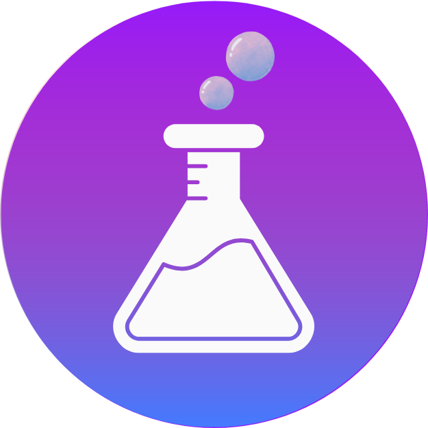

<div align="center">



# Bubble Lab

### Open-source agentic workflow automation builder with full observability and exportability.

[](https://discord.com/invite/PkJvcU2myV)
[](https://docs.bubblelab.ai/intro)
[](https://github.com/bubblelabai/BubbleLab/stargazers)
[](https://github.com/bubblelabai/BubbleLab/actions/workflows/ci.yml)
[](./LICENSE.txt)
[](https://www.typescriptlang.org/)

[Try it](https://app.bubblelab.ai/) - [Demos](https://www.bubblelab.ai/demos)

---

### Editing Flows


### Running Flows


</div>

## 📋 Overview

[**Bubble Lab**](https://www.bubblelab.ai/) is a Typescript-native workflow automation platform built for developers who need full control, transparency, and type safety. Unlike traditional workflow builders that lock you into proprietary JSON nodes, Bubble Lab compiles everything into clean, production-ready TypeScript that you can own, debug, and deploy anywhere.

**Key Features:**

- **Prompt to Workflow**: Describe what you want in natural language, and Pearl (our AI Assistant) instantly generate and amend working typescript workflows using our composable bubble system (integrations, tools) with branching and transformations. You get the visual, speed, and full flexibility of code.
- **Full Observability**: Built-in execution tracing with detailed logs, token usage and cost usage tracking for each supported services, and performance metrics. Debug with complete visibility into every step.
- **Import from n8n/other workflow platform**: Migrate existing workflows seamlessly such as n8n. Any human-readable workflow can be converted bubble lab workflow with a good enough model.
- **Export as TypeScript/API Instantly**: Own your workflows completely. Export clean, production-ready code that runs anywhere—integrate with your codebase, CI/CD pipelines.

## 🚀 Quick Start

### 1. Hosted Bubble Studio (Cloud Version)

No setup required, start building immediately with managed integrations 👉 [Try Now](https://app.bubblelab.ai)

### 2. Run Locally

Run Bubble Studio locally in **2 commands**:

```bash
# 1. Install dependencies
pnpm install

# 2. Start everything
pnpm run dev
```

Open **http://localhost:3000** and start building workflows!

**⚠️ Note:** To create flow with pearl (our ai assistant), you'll need API keys (GOOGLE_API_KEY and OPENROUTER_API_KEY). By default gemini-3.0-pro is used for generation and code edits use fast find-and-replace. Weaker model is not well tested and can lead to degraded/inconsistent performance. See [CONTRIBUTING.md](./CONTRIBUTING.md) for detailed setup instructions.

### 3. Create BubbleLab App

Get started with BubbleLab in seconds using our CLI tool:

```bash
npx create-bubblelab-app
```

This will scaffold a new BubbleLab project with:

- Pre-configured TypeScript setup with core packages and run time installed
- Sample templates (basic, reddit-scraper, etc.) you can choose
- All necessary dependencies
- Ready-to-run example workflows you fully control, customize

**Next steps after creation:**

```bash
cd my-agent
npm install
npm run dev
```

#### What You'll Get: Real-World Example

Let's look at what BubbleFlow code actually looks like using the **reddit-scraper** template:

**The Flow** (`reddit-news-flow.ts`) - Just **~50 lines** of clean TypeScript:

```typescript
export class RedditNewsFlow extends BubbleFlow<'webhook/http'> {
  async handle(payload: RedditNewsPayload) {
    const subreddit = payload.subreddit || 'worldnews';
    const limit = payload.limit || 10;

    // Step 1: Scrape Reddit for posts
    const scrapeResult = await new RedditScrapeTool({
      subreddit: subreddit,
      sort: 'hot',
      limit: limit,
    }).action();

    const posts = scrapeResult.data.posts;

    // Step 2: AI analyzes and summarizes the posts
    const summaryResult = await new AIAgentBubble({
      message: `Analyze these top ${posts.length} posts from r/${subreddit}:
        ${postsText}

        Provide: 1) Summary of top news, 2) Key themes, 3) Executive summary`,
      model: { model: 'google/gemini-2.5-flash' },
    }).action();

    return {
      subreddit,
      postsScraped: posts.length,
      summary: summaryResult.data?.response,
      status: 'success',
    };
  }
}
```

**What happens when you run it:**

```bash
$ npm run dev

✅ Reddit scraper executed successfully
{
  "subreddit": "worldnews",
  "postsScraped": 10,
  "summary": "### Top 5 News Items:\n1. China Halts US Soybean Imports...\n2. Zelensky Firm on Ukraine's EU Membership...\n3. Hamas Demands Release of Oct 7 Attackers...\n[full AI-generated summary]",
  "timestamp": "2025-10-07T21:35:19.882Z",
  "status": "success"
}

Execution Summary:
  Total Duration: 13.8s
  Bubbles Executed: 3 (RedditScrapeTool → AIAgentBubble → Return)
  Token Usage: 1,524 tokens (835 input, 689 output)
  Memory Peak: 139.8 MB
```

**What's happening under the hood:**

1. **RedditScrapeTool** scrapes 10 hot posts from r/worldnews
2. **AIAgentBubble** (using Google Gemini) analyzes the posts
3. Returns structured JSON with summary, themes, and metadata
4. Detailed execution stats show performance and token usage

**Key Features:**

- **Type-safe** - Full TypeScript support with proper interfaces
- **Simple** - Just chain "Bubbles" (tools/nodes) together with `.action()`
- **Observable** - Built-in logging shows exactly what's executing
- **Production-ready** - Error handling, metrics, and performance tracking included

## 📚 Documentation

**Learn how to use each bubble node and build powerful workflows:**

👉 [Visit BubbleLab Documentation](https://docs.bubblelab.ai/)

The documentation includes:

- Detailed guides for each node type
- Workflow building tutorials
- API references
- Best practices and examples

## 🤝 Community & Support

> **⚠️ UPDATE (January 20, 2026)**: We are no longer accepting code contributions or pull requests at this time. However, we still welcome and encourage:
>
> - 🐛 **Bug reports** - Help us identify issues
> - 💬 **Feature requests** - Share your ideas for improvements
> - 🗨️ **Community discussions** - Join conversations in Discord
> - 📖 **Documentation feedback** - Suggest improvements to our docs
>
> Thank you to everyone who has contributed and shown interest in Bubble Lab!

**Get involved:**

- [Join our Discord community](https://discord.gg/PkJvcU2myV) for discussions and support
- [Open issues](https://github.com/bubblelabai/BubbleLab/issues) for bugs or feature requests
- Check out **[CONTRIBUTING.md](./CONTRIBUTING.md)** for project setup and architecture details

## License

Apache 2.0
